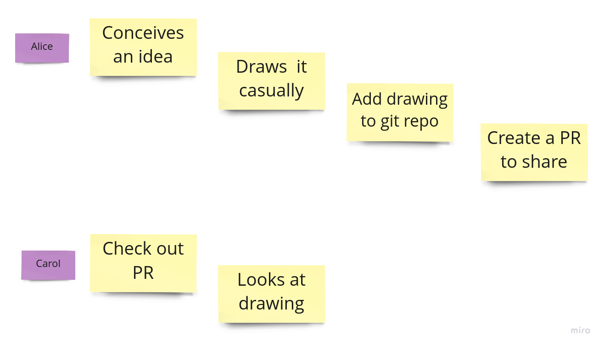

## To share once

### Draw locally and share via git

Using

- Miro board to draw
- Github to store and share

#### Alice

##### Draws

- Open Miro
- Open project in Miro
- Draw
- Export and download as image

##### Stores

- Add the downloaded image to repository
- Commit to git
- Push to github

##### Shares

- Open a pull request

#### Carol

##### View /by others/

- Check out pull request
- Open drawing
